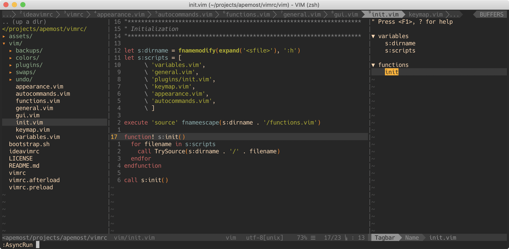

# Andrew's vimrc

[](https://app.codacy.com/manual/apemost/vimrc?utm_source=github.com&utm_medium=referral&utm_content=apemost/vimrc&utm_campaign=Badge_Grade_Dashboard)
[](https://github.com/apemost/vimrc/actions?query=workflow%3Aunit-tests)
[](https://github.com/apemost/vimrc)
[](https://github.com/apemost/vimrc/pulls)

A simple but powerful vim configuration, continually used and tweaked since 2017.



## Trying with Docker

```bash
docker run -it --rm apemost/dotfiles vim
```

## Installation

You can clone this repository wherever you want. To install, run command:

```bash
git clone https://github.com/apemost/vimrc.git && cd vimrc && source bootstrap.sh
```

To update, `cd` into your local `vimrc` repository and then:

```bash
source bootstrap.sh
```

## Setting up for the first time

We will automatically setting up the [vim-plug](https://github.com/junegunn/vim-plug)
plugin manager when you open vim for the first time.

Then, you can:

- run `:PlugInstall` to install the plugins
- run `:PlugUpdate` to update the plugins
- see [tutorial](https://github.com/junegunn/vim-plug/wiki/tutorial) page to learn the basics of vim-plug

## Adding your own customization

To conveniently add your own customization, copy [vimrc.preload](vimrc.preload)
to `~/.vimrc.preload`, and [vimrc.afterload](vimrc.afterload) to `~/.vimrc.afterlaod`.

### Changing the default color scheme

Edit `~/.vimrc.preload`:

```vim
let g:custom_background = 'light'
let g:custom_colorscheme = 'solarized'
```

### Enable completion and lint plugins

The completion and lint plugins are disabled by default. To enable them, edit `~/.vimrc.preload`:

```vim
let g:custom_completion_plugin = 'youcompleteme'
let g:custom_lint_plugin = 'ale'
```

### Adding your plugins

Edit `~/.vimrc.preload`:

```vim
let g:custom_plugins = [
      \   ['NLKNguyen/papercolor-theme'],
      \ ]
```

Reload `.vimrc` and run `:PlugInstall`.

### Disable built-in plugins

Edit `~/.vimrc.preload`:

```vim
let g:custom_disabled_plugins = [
      \   'sneak',
      \   'go',
      \ ]
```

## Consistent experience for IdeaVim

Link the [ideavimrc](ideavimrc) to `~/.ideavimrc`:

```bash
ln -s "$PWD/ideavimrc" ~/.ideavimrc
```

Or:

```bash
cp ideavimrc ~/.ideavimrc
```

## Consistent experience for VSCodeVim

Copy the content of [vscodevim.json](vscodevim.json) to your VS Code configuration file such as `settings.json`.

## Uninstallation

Run `rm ~/.vimrc`.

## FAQ

### How dare you remap s?

> You can specify any mapping for Sneak (see `:help sneak`). By the way: `cl` is equivalent to `s`, and `cc` is equivalent to `S`.

See https://github.com/justinmk/vim-sneak#how-dare-you-remap-s

To disable Sneak, see [Disable built-in plugins](#disable-built-in-plugins)

## Contributing

All contributions are welcome!
If you would like to hack on this work, please follow these steps:

1. [Fork this repository](https://github.com/apemost/vimrc/fork)
2. Make your changes
3. [Submit a pull request](https://github.com/apemost/vimrc/pull/new/main)

## License

[MIT](LICENSE)
